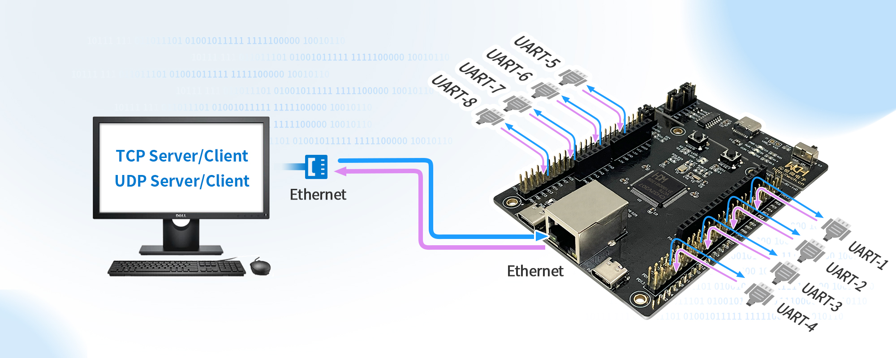
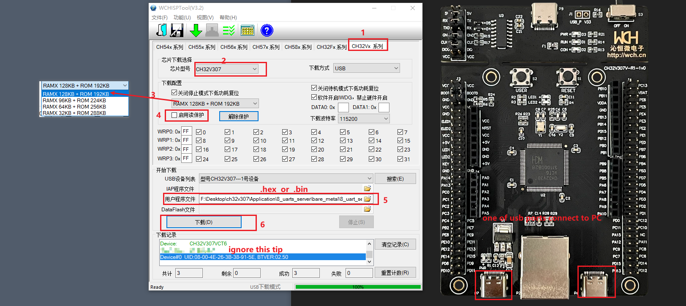

# 8_uart_server

Based on the powerful peripherals of eight UART interfaces and 10M Ethernet, eight serial port servers can be realized through a single chip ch32v307, and each uart works independently.

* RT-Thread/uart_server_rtt is the 8 uarts server demo developed based on RT_Thread,LwIP.
* bart_metal/8_uart_server is the 8 uarts server demo developed based on WCH_NET_lib with no-os.

## notes

CH32V307 RAM and Flash can be configured to the followings by WCHISPTool,

* 32KB RAM + 288KB Flash
* 64KB RAM + 256KB Flash
* 96KB RAM + 224KB Flash
* 128KB RAM + 192KB Flash.

WCHISPTool download link: http://www.wch.cn/downloads/WCHISPTool_Setup_exe.html 

this demo configures 128KB RAM + 192KB Flash, the configuration steps are as follows:

1. switch boot mode: BOOT0 = 1, BOOT1 = 0
2. 

3. switch back to boot mode : BOOT0 = 0, BOOT1 = 0. then , develop with wch-Link

