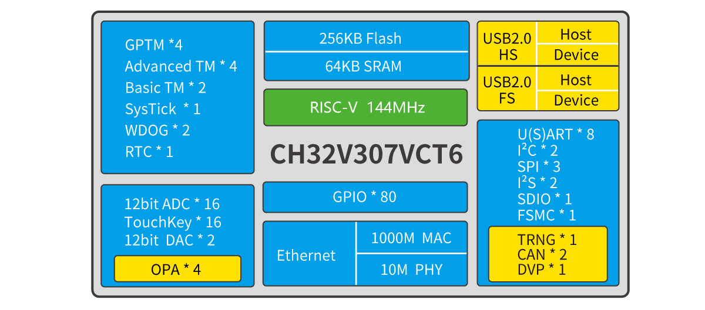

# 32位互联型RISC-V单片机CH32V307

[EN](README.md) | 中文

### 概述

CH32V305/7系列是基于32位RISC-V设计的互联型微控制器，配备了硬件堆栈区、快速中断入口，在标准RISC-V基础上大大提高了中断响应速度。加入单精度浮点指令集，扩充堆栈区，具有更高的运算性能。扩展串口U(S)ART数量到8组，电机定时器到4组。提供USB2.0高速接口（480Mbps）并内置了PHY收发器，以太网MAC升级到千兆并集成了10M-PHY模块。

### 系统框图

### 产品特点

- RISC-V4F处理器，最高144MHz系统主频
- 支持单周期乘法和硬件除法，支持硬件浮点运算(FPU)
- 64KB SRAM，256KB Flash
- 供电电压：2.5/3.3V，GPIO单元独立供电
- 多种低功耗模式：睡眠、停止、待机
- 上/下电复位、可编程电压检测器
- 2组18路通用DMA
- 4组运放比较器
- 1个随机数发生器TRNG
- 2组12位DAC转换
- 2单元16通道12位ADC转换，16路触摸按键TouchKey
- 10组定时器
- USB2.0全速OTG接口
- USB2.0高速主机/设备接口（480Mbps 内置PHY）
- 3个USART接口和5个UART接口
- 2个CAN接口（2.0B主动）
- SDIO接口、FSMC接口、DVP数字图像接口
- 2组IIC接口、3组SPI接口、2组IIS接口
- 千兆以太网控制器ETH（内置10M PHY）
- 80个I/O口，可以映射到16外部中断
- CRC计算单元，96位芯片唯一ID
- 串行2线调试接口
- 封装形式：LQFP64M、LQFP100