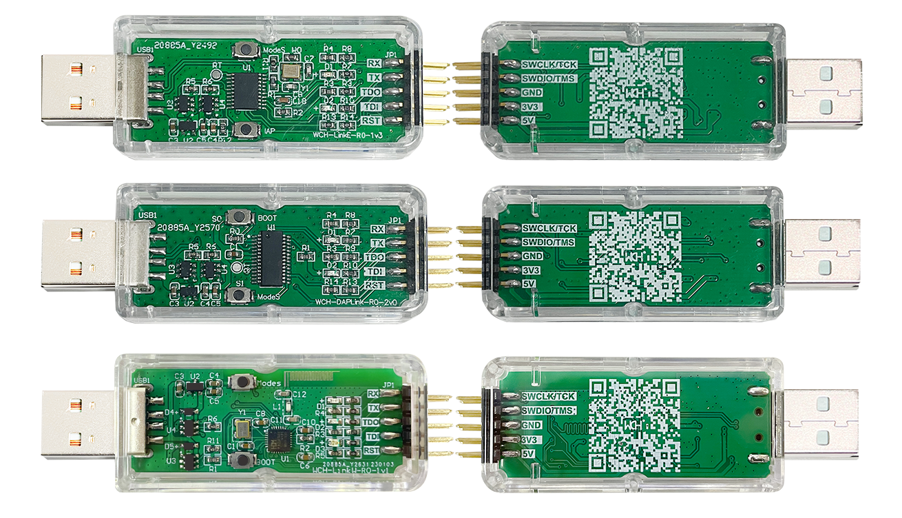

# WCH-Link
WCH-Link、WCH-LinkE、WCH-DAPLink.

[EN](README.md) | 中文

### 工具和手册
* 下载网址
* WCH-Link Introduction-https://www.wch.cn/products/WCH-Link.html
* MounRiver Studio-http://www.mounriver.com/
* WCH-LinkUtility-https://www.wch.cn/downloads/WCH-LinkUtility_ZIP.html
* WCHISPStudio-https://www.wch.cn/downloads/WCHISPTool_Setup_exe.html
* WCHLinkEJtagUpdTool-https://www.wch.cn/downloads/WCHLinkEJtagUpdTool_ZIP.html
* WCH-LinkSCH.PDF-https://www.wch.cn/downloads/WCH-LinkSCH_PDF.html
* WCH-LinkUserManual.PDF-https://www.wch.cn/downloads/WCH-LinkUserManual_PDF.html
* WCH-LinkUtility.ZIP-https://www.wch.cn/downloads/WCH-LinkUtility_ZIP.html
